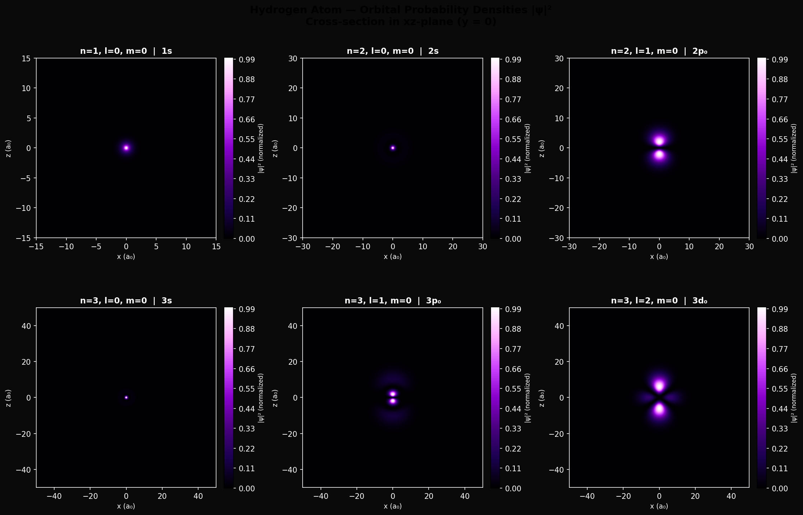
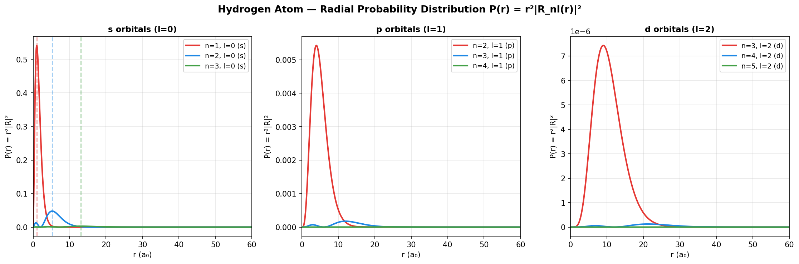
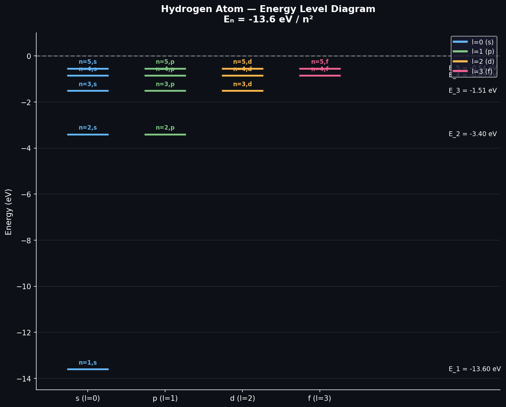

# Hydrogen Atom Wavefunction Visualizer

**Author:** Anubhav  
**Physics:** Quantum Mechanics — Atomic Orbitals  
**Language:** Python (NumPy, SciPy, Matplotlib)

---

## Physics Background

The hydrogen atom is the only atom with an **exact analytical solution** to the Schrödinger equation:

$$\hat{H}\psi = E\psi \quad \Rightarrow \quad -\frac{\hbar^2}{2m}\nabla^2\psi - \frac{e^2}{4\pi\epsilon_0 r}\psi = E\psi$$

The complete wavefunction separates into radial and angular parts:

$$\psi_{nlm}(r,\theta,\phi) = R_{nl}(r) \cdot Y_l^m(\theta,\phi)$$

### Quantum Numbers
| Symbol | Name | Values | Physical meaning |
|--------|------|--------|-----------------|
| n | Principal | 1, 2, 3... | Energy level |
| l | Azimuthal | 0 to n-1 | Orbital shape (s,p,d,f) |
| m | Magnetic | -l to +l | Orbital orientation |

### Energy Levels (Bohr formula)
$$E_n = -\frac{13.6 \text{ eV}}{n^2}$$

### Radial Wavefunction
$$R_{nl}(r) = \sqrt{\left(\frac{2}{na_0}\right)^3 \frac{(n-l-1)!}{2n[(n+l)!]^3}} e^{-r/na_0} \left(\frac{2r}{na_0}\right)^l L_{n-l-1}^{2l+1}\left(\frac{2r}{na_0}\right)$$

Where $L$ are the **Associated Laguerre Polynomials**.

---

## What This Code Visualizes

### 1. Orbital Probability Densities (|ψ|²)
Cross-sections of electron probability clouds in the xz-plane for:
- **1s** — spherically symmetric ground state
- **2s** — ground state with one radial node
- **2p₀** — dumbbell shaped along z-axis
- **3s, 3p₀, 3d₀** — higher excited states

### 2. Radial Probability Distribution P(r)
$$P(r) = r^2 |R_{nl}(r)|^2$$
Shows where the electron is most likely to be found at radius r.

### 3. Energy Level Diagram
Hydrogen spectrum showing all levels up to n=5.

---

## Results

### Orbital Shapes


### Radial Probability Distributions


### Energy Level Diagram


---

## How to Run

```bash
# Clone repository
git clone https://github.com/yourusername/hydrogen-atom-visualizer.git
cd hydrogen-atom-visualizer

# Install dependencies
pip install numpy scipy matplotlib

# Run
python hydrogen_atom.py
```

---

## Output Files

| File | Description |
|------|-------------|
| `hydrogen_orbitals.png` | 6 orbital cross-sections |
| `hydrogen_radial.png` | Radial probability distributions |
| `hydrogen_energy_levels.png` | Energy level diagram |

---

## Key Physics Observations

- **1s orbital:** Spherically symmetric, maximum probability at r = a₀ (Bohr radius)
- **2s orbital:** Spherical with one radial node (zero at r ≈ 2a₀)
- **2p orbital:** Dumbbell shape — angular node at θ = 90°
- **Radial nodes:** Number of nodes = n - l - 1
- **Energy degeneracy:** All orbitals with same n have same energy in hydrogen

---

## File Structure

```
hydrogen-atom-visualizer/
├── hydrogen_atom.py              # Main visualization code
├── hydrogen_orbitals.png         # Orbital probability densities
├── hydrogen_radial.png           # Radial distributions
├── hydrogen_energy_levels.png    # Energy level diagram
└── README.md                     # This file
```

---

## References

- Griffiths — *Introduction to Quantum Mechanics* (2nd ed.) Ch. 4
- Sakurai & Napolitano — *Modern Quantum Mechanics*
- Cohen-Tannoudji — *Quantum Mechanics* Vol. 1
- NIST Atomic Spectra Database

---

## Future Extensions

- [ ] Interactive orbital selector (ipywidgets)
- [ ] 3D isosurface rendering
- [ ] Zeeman effect (magnetic field splitting)
- [ ] Linear combination of atomic orbitals (LCAO)
- [ ] Hydrogen emission spectrum simulation
